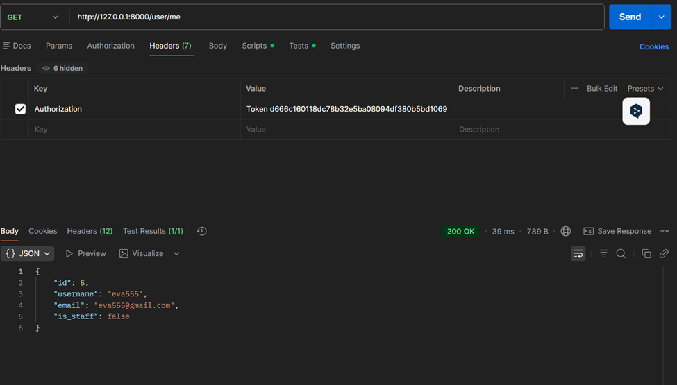
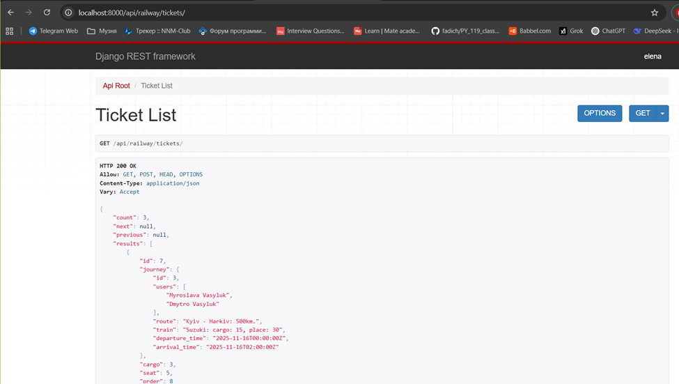

# Railway Service API

## Опис проекту

Цей API проект призначений для адміністрування руху потягів на залізничних станціях, для реєстрації користувачів залізничної мережі і придбання ними квитків.

## Функціонал

- Всі моделі зареєстровані в адмін панелі
- В адмін панелі в замовленнях можна одразу створювати квитки
- Створена сторінка реєстрації користувачів `user/register`
- Реалізована токен аутентифікація (токен можна отримати на сторінці `user/login`)
- Всі сторінки окрім реєстрації тільки для аутентифікованих користувачів
- Сторінка `user/me` дає змогу редагувати дані про себе
- Пароль користувача зберігається у зашифрованому вигляді
- Для всіх роутів реалізовано CRUD
- Роути `api/railway/traintypes` та `user/crew` можна редагувати тільки адмінам, іншим доступні тільки безпечні методи
- Для всіх сторінок реалізована пагінація по 5 об'єктів на сторінку
- Роут `api/railway/train` можна фільтрувати за типами, передавши їх в query string під ім'ям `train_types`
- На роуті `api/railway/journey` додано відображення кількості доступних квитків
- Роути `api/railway/ticket` та `api/railway/order` відображають квитки та замовлення тільки залогіненого користувача
- Сторінка `api/railway/ticket` упорядковується за вагонами і купленими в них місцями
- Всі сторінки коректно відображаються і всі запити оптимізовані
- В проекті використано серіалайзери та вкладені серіалайзери

## Як запустити проект локально

### Крок 1: Клонування та встановлення залежностей

Виконайте такі команди в терміналі:

```bash
git clone https://github.com/Dmitriy527/railway_service.git
cd railway_service
pip install -r requirements.txt
python manage.py makemigrations
python manage.py migrate
```

### Крок 2: Налаштування бази даних SQLite

В налаштуваннях проекту в пункті `DATABASES` потрібно розкоментувати такі рядки:

```python
'default': {
    'ENGINE': 'django.db.backends.sqlite3',
    'NAME': BASE_DIR / 'db.sqlite3',
}
```

та закоментувати такі рядки:

```python
"default": {
    "ENGINE": "django.db.backends.postgresql",
    "NAME": os.environ.get("POSTGRES_DB"),
    "USER": os.environ.get("POSTGRES_USER"),
    "PASSWORD": os.environ.get("POSTGRES_PASSWORD"),
    "HOST": os.environ.get("POSTGRES_HOST"),
    "PORT": os.environ.get("POSTGRES_PORT"),
}
```

### Крок 3: Створення файлу .env

В корені проекту створіть файл `.env` з наступним вмістом:

```
POSTGRES_PASSWORD=your_password
POSTGRES_USER=your_user
POSTGRES_DB=your_db
POSTGRES_HOST=db
POSTGRES_PORT=5432
PGDATA=/var/lib/postgresql/data
SECRET_KEY=your_secret_key
```

### Крок 4: Створення суперкористувача

```bash
python manage.py createsuperuser
```

### Крок 5: Запуск проекту

```bash
python manage.py runserver
```

## Як запустити проект в Docker Desktop

### Крок 1: Встановлення Docker Desktop

Завантажте та встановіть Docker Desktop за посиланням: https://www.docker.com/products/docker-desktop/

### Крок 2: Клонування проекту

```bash
git clone https://github.com/Dmitriy527/railway_service.git
cd railway_service
```

### Крок 3: Створення файлу .env

В корені проекту створіть файл `.env` з наступним вмістом:

```
POSTGRES_PASSWORD=your_password
POSTGRES_USER=your_user
POSTGRES_DB=your_db
POSTGRES_HOST=db
POSTGRES_PORT=5432
PGDATA=/var/lib/postgresql/data
SECRET_KEY=your_secret_key
```

### Крок 4: Налаштування бази даних PostgreSQL

В налаштуваннях проекту в пункті `DATABASES` потрібно розкоментувати такі рядки:

```python
"default": {
    "ENGINE": "django.db.backends.postgresql",
    "NAME": os.environ.get("POSTGRES_DB"),
    "USER": os.environ.get("POSTGRES_USER"),
    "PASSWORD": os.environ.get("POSTGRES_PASSWORD"),
    "HOST": os.environ.get("POSTGRES_HOST"),
    "PORT": os.environ.get("POSTGRES_PORT"),
}
```

та закоментувати такі рядки:

```python
'default': {
    'ENGINE': 'django.db.backends.sqlite3',
    'NAME': BASE_DIR / 'db.sqlite3',
}
```

### Крок 5: Створення та запуск контейнерів

```bash
docker-compose up --build
```

### Крок 6: Створення суперкористувача

Відкрийте нову вкладку в терміналі та виконайте:

```bash
docker-compose exec railway_service python manage.py createsuperuser
```

### Крок 7: Використання проекту

Використовуйте посилання: http://localhost:8001/

## Інструкція по використанню API

- Для реєстрації нового користувача використовуйте `user/register`
- Для отримання токену використовуйте `user/login`
- Документація API доступна за посиланням: `api/schema/swagger-ui/`

## Приклади запитів

### Postman - запит на сторінку `user/me`



### Browsable API

#### Запит на сторінку `api/railway/tickets/`



#### Запит на сторінку `api/railway/orders/`


#### Запит на сторінку `api/railway/journeys/`


## Діаграма структури бази даних


## Автор

**Дмитро Дмитрович Василюк**

Email: dimkanividimka4@gmail.com