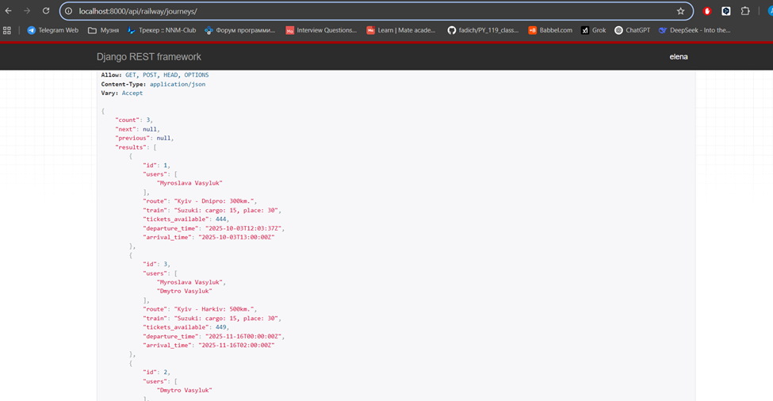
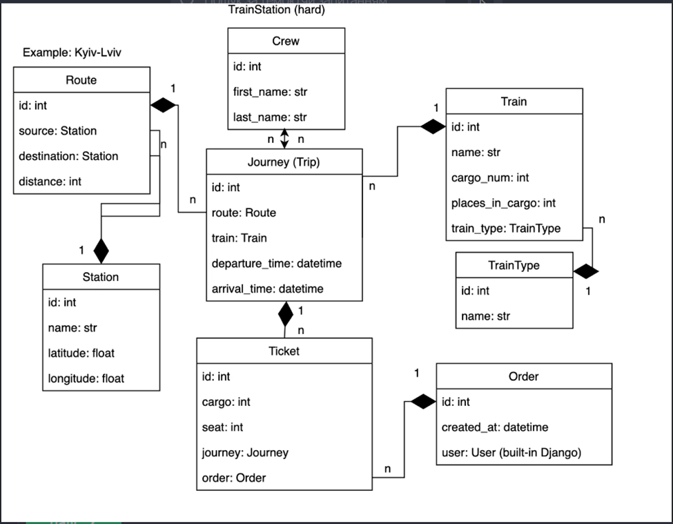

# Railway Service API

## Project Description

This API project is designed for managing train traffic at railway stations, registering users of the railway network, and allowing them to purchase tickets.

## Features

- All models are registered in the admin panel
- In the admin panel, tickets can be created directly in orders
- User registration page created at `user/register`
- Token authentication implemented (token can be obtained at `user/login` page)
- All pages except registration are only for authenticated users
- `user/me` page allows editing your own data
- User password is stored in encrypted form
- CRUD implemented for all routes
- Routes `api/railway/traintypes` and `user/crew` can only be edited by admins, other users have access only to safe methods
- Pagination implemented for all pages with 5 objects per page
- Route `api/railway/train` can be filtered by types by passing them in query string under the name `train_types`
- Route `api/railway/journey` shows the number of available tickets
- Routes `api/railway/ticket` and `api/railway/order` display tickets and orders only for the logged-in user
- Page `api/railway/ticket` is ordered by carriages and seats purchased in them
- All pages are displayed correctly and all queries are optimized
- The project uses serializers and nested serializers

## How to Run the Project Locally

### Step 1: Cloning and Installing Dependencies

Execute the following commands in the terminal:

```bash
git clone https://github.com/Dmitriy527/railway_service.git
cd railway_service
pip install -r requirements.txt
python manage.py makemigrations
python manage.py migrate
```

### Step 2: Setting Up SQLite Database

In the project settings in the `DATABASES` section, you need to uncomment the following lines:

```python
'default': {
    'ENGINE': 'django.db.backends.sqlite3',
    'NAME': BASE_DIR / 'db.sqlite3',
}
```

and comment out the following lines:

```python
"default": {
    "ENGINE": "django.db.backends.postgresql",
    "NAME": os.environ.get("POSTGRES_DB"),
    "USER": os.environ.get("POSTGRES_USER"),
    "PASSWORD": os.environ.get("POSTGRES_PASSWORD"),
    "HOST": os.environ.get("POSTGRES_HOST"),
    "PORT": os.environ.get("POSTGRES_PORT"),
}
```

### Step 3: Creating .env File

In the project root, create a `.env` file with the following content:

```
POSTGRES_PASSWORD=your_password
POSTGRES_USER=your_user
POSTGRES_DB=your_db
POSTGRES_HOST=db
POSTGRES_PORT=5432
PGDATA=/var/lib/postgresql/data
SECRET_KEY=your_secret_key
```

### Step 4: Creating Superuser

```bash
python manage.py createsuperuser
```

### Step 5: Running the Project

```bash
python manage.py runserver
```

## How to Run the Project in Docker Desktop

### Step 1: Installing Docker Desktop

Download and install Docker Desktop from: https://www.docker.com/products/docker-desktop/

### Step 2: Cloning the Project

```bash
git clone https://github.com/Dmitriy527/railway_service.git
cd railway_service
```

### Step 3: Creating .env File

In the project root, create a `.env` file with the following content:

```
POSTGRES_PASSWORD=your_password
POSTGRES_USER=your_user
POSTGRES_DB=your_db
POSTGRES_HOST=db
POSTGRES_PORT=5432
PGDATA=/var/lib/postgresql/data
SECRET_KEY=your_secret_key
```

### Step 4: Setting Up PostgreSQL Database

In the project settings in the `DATABASES` section, you need to uncomment the following lines:

```python
"default": {
    "ENGINE": "django.db.backends.postgresql",
    "NAME": os.environ.get("POSTGRES_DB"),
    "USER": os.environ.get("POSTGRES_USER"),
    "PASSWORD": os.environ.get("POSTGRES_PASSWORD"),
    "HOST": os.environ.get("POSTGRES_HOST"),
    "PORT": os.environ.get("POSTGRES_PORT"),
}
```

and comment out the following lines:

```python
'default': {
    'ENGINE': 'django.db.backends.sqlite3',
    'NAME': BASE_DIR / 'db.sqlite3',
}
```

### Step 5: Creating and Running Containers

```bash
docker-compose up --build
```

### Step 6: Creating Superuser

Open a new terminal tab and execute:

```bash
docker-compose exec railway_service python manage.py createsuperuser
```

### Step 7: Using the Project

Use the link: http://localhost:8001/

## API Usage Instructions

- To register a new user, use `user/register`
- To obtain a token, use `user/login`
- API documentation is available at: `api/schema/swagger-ui/`

## Request Examples

### Postman - Request to `user/me` Page


### Browsable API

#### Request to `api/railway/tickets/` Page


#### Request to `api/railway/orders/` Page


#### Request to `api/railway/journeys/` Page



## Database Structure Diagram



## Author

**Dmytro Dmytrovych Vasyliuk**

Email: dimkanividimka4@gmail.com